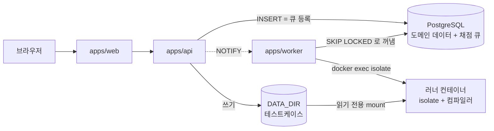

# OJIK 오직

온라인 저지입니다. 문제를 풀고 제출하면 샌드박스 안에서 채점합니다.
교재, 문제집, 대회, 코딩 테스트를 하나의 구조로 다룹니다.

이름은 **OJ**(Online Judge)에 만든 사람 핸들을 이어 붙인 것이고, 한국어로 **오직**으로 읽힙니다.

---

## 목차

- [구조](#구조)
- [설계 원칙](#설계-원칙)
- [운영](#운영)
- [개발](#개발)
- [변경 이력](#변경-이력)

---

## 구조

### 저장소 구성

```
packages/core      모든 패키지가 참조하는 단일 출처
packages/db        Drizzle 스키마, 마이그레이션, 채점 큐 연산
apps/api           Hono REST API
apps/worker        채점 오케스트레이터
apps/web           SvelteKit SPA
images/runner      언어별 채점 런타임 이미지
scripts            운영 스크립트
tests              판정 규칙과 큐 동작 테스트
```

전부 TypeScript입니다. **러너 컨테이너 안에는 우리 코드가 한 줄도 없습니다.** 컴파일러와
`isolate`뿐이고, 채점 로직은 워커 프로세스에 있습니다.

### 실행 구조



**메시지 큐가 없습니다.** 제출 테이블이 곧 큐입니다.

### 컬렉션

교재, 문제집, 대회, 코딩 테스트를 각각의 타입으로 두지 않습니다. 넷의 차이는 **정책 축의 값**뿐이라
`collections` 한 테이블로 다룹니다.

| | 시간 창 | 결과 공개 | 순위 | 참가 | 본문 |
|---|---|---|---|---|---|
| **교재** | 없음 | 즉시 | 없음 | 공개 | 설명 + 문제 |
| **문제집** | 기한(선택) | 즉시 | 진도 | 멤버 | 문제만 |
| **대회** | 고정 | 동결 | ICPC/IOI | 등록 | 문제만 |
| **코딩 테스트** | 개인별 | 종료 후 | 없음 | 초대 | 문제만 |

화면에서는 프리셋 버튼이 축 값을 채워 주므로 사용자는 축의 존재를 몰라도 됩니다.
정의는 [`packages/core/src/collections.ts`](packages/core/src/collections.ts)에 있습니다.

### 문서

| 문서 | 내용 |
|---|---|
| [`docs/architecture.md`](docs/architecture.md) | 전체 구조, 제출부터 판정까지의 흐름, 컴포넌트 간 계약 |
| [`docs/judge-pipeline.md`](docs/judge-pipeline.md) | 큐 설계, 상주 러너 풀, 보안 경계, 판정 규칙 |
| [`docs/schema.md`](docs/schema.md) | 테이블 구조와 인덱스 설계 근거 |
| [`docs/development.md`](docs/development.md) | 로컬 실행, 흔한 문제 |
| [`docs/koj-differences.md`](docs/koj-differences.md) | 참고한 KOJ에서 무엇을 왜 바꿨는지 |

---

## 설계 원칙

- **단일 출처.** 언어 목록은 [`languages.ts`](packages/core/src/languages.ts) 한 곳에만 있습니다.
  API 검증, 워커 실행, 프론트 선택지, PG enum이 전부 여기서 나옵니다.
- **조용한 실패 금지.** 설정 파싱에 실패하면 프로세스가 즉시 종료합니다. 지원하지 않는 언어는
  제출 단계에서 거부합니다. 빈 설정으로 계속 진행하지 않습니다.
- **복사하지 않기.** 테스트케이스는 러너 컨테이너에 읽기 전용으로 붙습니다. 제출마다 복사하지
  않습니다.
- **판정과 상태의 분리.** `status`는 채점이 어디까지 갔는지, `verdict`는 결과입니다. 시간 초과가
  오답으로 뭉개지지 않습니다.
- **재현 가능성이 저장보다 싸다.** 케이스별 출력을 다 저장하는 대신 소스와 테스트케이스를 남겨
  언제든 다시 채점합니다.

---

## 운영

### 필요한 것

| 항목 | 비고 |
|---|---|
| Node 22 이상 | `process.loadEnvFile`을 씁니다 |
| Docker | PostgreSQL과 러너 컨테이너 |
| 리눅스 커널 | `isolate`가 cgroup v2를 직접 씁니다. Windows와 macOS는 Docker의 리눅스 VM으로 충족됩니다 |

컨테이너 런타임은 Docker Desktop, OrbStack, colima, 리눅스 네이티브 Docker 어느 쪽이든 됩니다.
워커가 플랫폼에 맞는 접속 지점을 자동으로 고릅니다.

### 첫 설치

```bash
cp .env.example .env
node -e "console.log(require('crypto').randomBytes(32).toString('hex'))"
# 출력값을 .env 의 JWT_SECRET 에 넣습니다

npm install
npm run infra:up          # PostgreSQL
npm run db:migrate
npm run db:seed           # 개발용 계정과 예시 데이터

npm run runners:build     # 러너 이미지. 처음엔 몇 분 걸립니다
npm run smoke:judge       # 이게 통과해야 채점이 됩니다
```

**호스트 포트는 5432가 아니라 55432입니다.** 개발 PC에 PostgreSQL이 이미 깔려 있으면 5432를
그쪽이 잡고 있어서 연결이 그리로 갑니다. `POSTGRES_PORT`로 바꿀 수 있습니다.

### 실행

```bash
npm run dev:api           # :3000
npm run dev:web           # :5173
npm run dev:worker
```

### 명령

| 명령 | 용도 |
|---|---|
| `npm run db:test` | 테스트용 DB 준비. 처음 한 번, 그리고 마이그레이션이 늘 때마다 |
| `npm test` | 판정 규칙, 큐 동작, 순위표. 워커를 켜 둔 채로 돌려도 됨 |
| `npm run test:unit` | 판정 규칙만. DB 불필요 |
| `npm run typecheck` | 전 패키지 |
| `npm run smoke:judge` | isolate가 실물에서 도는지 확인. 등록된 전 언어를 한 번씩 돌림 |
| `npm run langs` | 지금 등록된 채점 언어와 필요한 러너 이미지 |
| `npm run e2e:submit` | 전 언어를 API 로 실제 제출해 판정까지 확인. API 와 워커 필요 |
| `npm run e2e:solutions` | 풀이 공유의 접근 규칙과 하루 한도 확인. API 와 워커 필요 |
| `npm run e2e:teaching` | 강사 권한과 수강생 관리 확인. API 필요 |
| `npm run check:data` | DB의 해시와 테스트케이스 파일 대조 |
| `npm run recount` | 캐시 컬럼 정정. `-- --apply`로 실제 반영 |
| `npm run set-role` | 사용자 권한 변경 |

### 테스트 주의

**테스트는 개발 DB 를 안 씁니다.** 같은 Postgres 안의 `<db>_test` 를 씁니다. 처음 한 번
준비해 두면 됩니다.

```bash
npm run db:test      # 만들고 마이그레이션 + 시드
npm test
```

나눠 둔 이유는 워커입니다. 테스트는 `submissions` 를 비우고 큐에 행을 넣는데, 같은 DB 를
보는 워커가 그걸 집어 갑니다. 그래서 전에는 테스트마다 워커를 멈췄다 켜야 했고, 잊으면
DB 를 쓰는 20건이 가드에 막혔습니다. 지금은 워커를 켜 둔 채로 돌려도 됩니다.

컨테이너를 따로 띄우지 않습니다. 같은 Postgres 안에 데이터베이스만 하나 더 만드니
메모리도 포트도 더 쓰지 않습니다.

**마이그레이션이 늘면 `npm run db:test` 를 다시 돌리세요.** 테스트 DB 는 자동으로 따라가지
않습니다. 안 돌리면 "시드 데이터가 없습니다" 나 컬럼 없음 오류가 납니다.

주소는 `TEST_DATABASE_URL` 로 바꿀 수 있습니다. 안 주면 `DATABASE_URL` 의 데이터베이스
이름에 `_test` 를 붙입니다.

### 운영 시 주의

**워커를 여럿 띄우려면 `WORKER_ID`와 `BOX_ID_BASE`를 워커마다 달리 줘야 합니다.**
같은 값이면 서로의 러너 컨테이너를 지우며 채점을 망칩니다. 같은 `WORKER_ID`로 두 번째 워커가
뜨면 거부되지만, `BOX_ID_BASE`가 겹치면 샌드박스 uid가 겹쳐 간헐적으로 실패합니다.

**`WORKER_CAPACITY * WORKER_TC_PARALLEL`이 CPU 코어 수를 넘으면 안 됩니다.** 넘으면 측정 시간이
부풀어 맞는 풀이가 시간 초과로 떨어집니다.

**성능 코어와 효율 코어가 섞인 CPU에서는 시간 측정이 흔들립니다.** 시간 제한을 넉넉히 잡거나,
그 환경에서 빡빡한 문제를 내지 않아야 합니다.

**러너 이미지나 isolate 버전을 올릴 때는 `npm run smoke:judge`를 먼저 통과시키세요.**
버전이 갈리면 플래그가 안 맞아 전 제출이 채점 오류가 됩니다.

**문제는 지우지 말고 비공개로 내리세요.** 삭제하면 제출 기록이 함께 사라집니다.

### 데이터

| 대상 | 위치 | 비고 |
|---|---|---|
| 도메인 데이터, 제출, 채점 결과 | PostgreSQL | |
| 테스트케이스 파일 | `DATA_DIR/problems/{id}/tc/` | DB는 sha256만 들고 있음 |
| 본문에 넣은 그림 | `DATA_DIR/uploads/{앞2}/{sha256}.{ext}` | DB에 행이 없음. 본문 마크다운이 곧 참조 |
| 채점 작업 공간 | `BOX_ROOT` | 휘발성. tmpfs 권장 |

DB와 `DATA_DIR`은 **같은 시점으로 함께 백업**해야 합니다. 따로 되돌리면 행은 있고 파일이 없는
상태가 되는데, `npm run check:data`가 그걸 잡아냅니다.

---

## 개발

### 스키마 변경

```bash
# 1. packages/db/src/schema/ 를 고친다
npm run db:generate      # 2. 마이그레이션 SQL 생성
# 3. 생성된 packages/db/drizzle/*.sql 을 읽어 본다
npm run db:migrate       # 4. 적용
# 5. SQL 파일과 스냅샷을 함께 커밋
```

**생성된 SQL을 읽지 않고 넘기지 마세요.** 컬럼 이름을 바꾸면 drizzle-kit이 `drop` + `add`로
해석해 데이터가 날아갈 수 있습니다.

기동 시 자동 마이그레이션은 하지 않습니다. 배포와 스키마 변경을 분리해야 되돌릴 수 있습니다.

### 언어 추가

[`packages/core/src/languages.ts`](packages/core/src/languages.ts)에 항목 하나를 넣습니다.
API 검증, 워커 실행, 프론트 선택지, PG enum이 전부 여기서 나옵니다. 지금 뭐가 있는지는
`npm run langs`로 봅니다. 이 문서에 목록을 적어 두지 않는 건 반드시 어긋나기 때문입니다.

**같은 런타임에 플래그만 다른 언어는 비용이 거의 없습니다.** C++17과 C99가 그런 경우로,
`c-cpp` 이미지를 그대로 쓰고 컴파일 argv만 다릅니다. 이미지가 안 늘어나니 부담 없이 늘릴 수
있습니다. 반대로 새 런타임은 이미지 하나와 디스크를 더 씁니다.

새 문법 강조가 필요하면 `EditorMode`에 먼저 값을 더합니다. 안 더하면 에디터가 조용히 C++
문법으로 떨어집니다.

새 런타임이 필요하면 [`images/runner/`](images/runner/)에 `Dockerfile.<runner>`를 추가하고
`RunnerId`에 이름을 더합니다.

```bash
npm run db:generate      # language enum 에 값이 추가되므로 마이그레이션 필요
npm run db:migrate
npm run runners:build    # 새 런타임을 넣었을 때만
npm run smoke:judge      # 샌드박스에서 도는지
npm run e2e:submit       # 제출부터 판정까지 실제 경로로
```

**`db:generate` 를 잊으면 제출이 INSERT 에서 깨집니다.** `smoke:judge` 는 DB 를 안 거쳐서 이걸
못 잡습니다. `npm test` 의 enum 테스트와 `e2e:submit` 이 잡습니다.

### CI

[`.github/workflows/ci.yml`](.github/workflows/ci.yml)가 푸시와 PR 에서 돕니다.
타입 검사, 마이그레이션, 시드, 테스트, 빌드까지 실제 Postgres 를 붙여서 봅니다.

마지막 단계로 `db:generate` 를 한 번 더 돌려 `packages/db/drizzle` 에 변경이 남는지 봅니다.
남으면 스키마를 고치고 생성물을 안 만든 것이라 실패합니다.

**채점 스모크는 CI 에서 안 돕니다.** `isolate` 가 cgroup v2 위임과 privileged 컨테이너를
요구해서 GitHub 러너에서 안정적으로 못 돌립니다. 샌드박스는 실기에서 `npm run smoke:judge`,
제출 경로는 `npm run e2e:submit` 으로 봅니다.

### 커밋

```
브랜치     work-YYYYMMDD
제목       한국어 명사구. feat: 같은 접두어를 쓰지 않는다
본문       변경이 클 때만. 무엇을 왜 바꿨는지
```

**PR을 열지 않습니다.** 혼자 쓰는 저장소라 검토할 사람이 자기 자신이고, 셀프 승인은
절차만 늘립니다. 작업 브랜치에서 하다가 묶음이 끝나면 `main`으로 합칩니다.

```bash
git checkout main
git merge --no-ff work-YYYYMMDD
git push origin main
```

`--no-ff`를 쓰는 이유는 한 묶음이 어디서 시작해 어디서 끝났는지가 이력에 남기 때문입니다.
fast-forward 로 붙이면 커밋이 일렬로 섞여서 나중에 "이 버전이 뭘 바꿨더라"를 태그 사이
범위로만 봐야 합니다.

작업 브랜치를 쓰는 건 CI 때문입니다. 푸시하면 어느 브랜치든 CI가 도니까, `main`이 항상
초록인 상태로 둘 수 있습니다.

---

## 변경 이력

버전은 의미 있는 기능 묶음이 끝날 때 올립니다. 날짜는 작업일입니다.

### 버전 규칙

`MAJOR.MINOR.PATCH`를 따르되, 1.0.0 전까지는 아래 기준으로 씁니다.

| 자리 | 올리는 때 |
|---|---|
| PATCH | 버그 수정, 문구 수정 |
| MINOR | 기능 추가, 스키마 변경 |
| MAJOR | 1.0.0 전까지 안 올림 |

**태그와 이 문서의 절이 1대1로 대응해야 합니다.** 태그만 있고 이력이 없거나 반대면,
나중에 "이 버전이 뭘 바꿨더라"를 코드에서 찾아야 합니다.

```bash
# 1. 아래 변경 이력에 새 절을 추가한다
# 2. 커밋한다
git tag -a v0.2.0 -m "v0.2.0 ..."
git push origin main --follow-tags
```

`--follow-tags`를 쓰면 커밋과 주석 태그가 같이 올라갑니다. 태그만 따로 올리는 걸 잊으면
GitHub의 릴리스 목록이 비어 보입니다.

태그는 **주석 태그**(`-a`)로 만듭니다. 가벼운 태그는 작성자와 날짜가 안 남습니다.

### 다음 (미출시)

- 항목별 마감. 교재에서 주차마다 마감이 다른 경우에 쓴다. 컬렉션 전체 시간 창과 별개다.
  넘겨도 제출은 막지 않고 지각으로 표시만 한다. 수업에서는 늦어도 받고 감점하는 쪽이
  보통이고, 막으면 강사가 예외를 만들 방법이 없다
- 수강생이 자기 진도를 본다. 컬렉션 화면에 맞힌 수와 막대, 항목마다 맞힘/시도함/안 함과
  마감 상태. 전에는 강사만 명단에서 볼 수 있었다
- 부분점수를 화면에 드러냈다. 채점기는 전부터 케이스별 배점으로 점수를 냈는데 볼 곳이
  없었다. 문제 화면에 부분점수임을 알리고, 제출 화면에 받은 배점을 보여 준다
- 성적표에 지각 제출을 표시한다. CSV 에서는 점수 뒤에 별표
- 테스트가 개발 DB 대신 `<db>_test` 를 쓴다. 워커를 켜 둔 채로 `npm test` 를 돌릴 수 있다.
  전에는 테스트마다 워커를 멈췄다 켜야 했고, 잊으면 20건이 가드에 막혔다
- 스페셜 저지. 출제자가 쓴 체커 프로그램이 판정한다. 답이 여러 개인 문제(아무 최단 경로나,
  조건을 만족하는 아무 배치나)는 문자열 비교로 채점이 안 된다. 체커는 인자로 입력, 기대 출력,
  제출 출력 세 파일을 받고 종료 코드 0 이면 정답, 1 이면 오답, 그 외는 채점 오류다.
  체커도 샌드박스에서 돌고 학생에게는 안 내려간다
- 화면 공통 값(색, 테두리, 표면)과 조각(카드, 버튼, 입력칸)을 CSS 에 모았다. 컴포넌트마다
  손으로 반복하다 보니 같은 뜻의 자리인데 화면마다 조금씩 달랐다
- 머리글을 화면에 붙이고, 좁은 화면에서 메뉴가 두 줄이 되는 대신 가로로 밀리게 했다

### v0.2.0 (2026-09-17) 수업에서 쓸 수 있는 상태로

v0.1.0 은 채점은 됐지만 브라우저로 할 수 있는 일이 거의 없었습니다. 문제 등록이 API 직접
호출이었고, 문제 본문이 평문이라 수식 하나 못 넣었습니다. 이 버전에서 수업 한 학기를
돌릴 수 있는 만큼을 채웠습니다.

**채점**

- 언어를 4종에서 8종으로. C++17, C99 는 `c-cpp` 이미지를 그대로 쓰고 플래그만 다릅니다.
  PyPy3 와 Node.js 22 는 이미지를 새로 만들었습니다
- 러너 지연 기동. 그 언어의 첫 제출까지 컨테이너를 안 띄웁니다. 기동 시 5개에서 1개로
- 문제 유형 셋: 코드 제출, 빈칸 채우기, 단답형. 셋 다 테스트케이스 표를 그대로 씁니다.
  유형마다 표를 두면 채점 결과와 점수 계산을 세 번 구현하게 됩니다
- 단답형은 큐를 안 탑니다. 샌드박스가 할 일이 없는데 큐를 태우면 대기만 늡니다
- 빈칸은 제출 시점에 완성된 코드가 됩니다. 워커는 코드 제출과 구분하지 않습니다

**강의**

- 전역 역할에 `instructor`. 서열은 사용자 < 강사 < 출제자 < 관리자
- 컬렉션 안의 역할 셋: 수강생, 조교, 공동 운영자. 전역 역할과 별개입니다.
  조교는 명단과 진도를 보고 문제를 고치되 구성과 명단은 못 바꿉니다
- 강의 전용 문제. 강사는 자기 강의에 묶인 문제만 냅니다. 공개 아카이브 목록에는
  관리자에게도 안 나오고, 소속을 바꾸는 건 출제자 이상만입니다
- 명단 파일(CSV)로 한 번에 등록. 계정이 없는 사람은 만들어 주고 임시 비밀번호를
  CSV 로 한 번 돌려줍니다. 전에는 수업 첫 주에 전원이 먼저 가입해야 했습니다
- 성적표. 학생 x 문제 표와 CSV 내보내기. 순위표와 다른 물건으로, 등수가 없고
  안 낸 칸과 내고 0점인 칸을 구분합니다

**작성**

- 문제 본문과 교재를 마크다운 편집기로 씁니다. 쓰기 / 나란히 / 미리보기 중에 고르고
  나란히가 기본입니다. 타자가 멈추면 미리보기가 따라옵니다
- SVG 그림판. 선, 화살표, 네모, 타원, 자유선, 글자. 결과 SVG 가 본문에 그대로 들어가
  파일이 안 생기고 도형 열 개짜리가 수백 바이트입니다. 선 색 기본값이 본문 글자색이라
  다크 모드에서도 보이고, 넣은 그림은 다시 열어 고칠 수 있습니다
- 그림 올리기. 붙여넣거나 끌어다 놓으면 올라갑니다. png, jpeg, gif, webp 만 받고 한 장 4MB.
  내용 앞바이트로 형식을 확인해 이름만 바꾼 파일을 막습니다. SVG 는 안 받습니다
- 코드 하이라이팅. 제출 소스와 본문의 코드 블록 둘 다. 라이브러리를 새로 넣지 않고
  이미 쓰는 CodeMirror 와 lezer 파서를 씁니다

**화면**

- 관리 화면. 문제 등록과 수정, 테스트케이스 편집, 컬렉션 구성, 권한 변경
- 마크다운 렌더링. 표, 코드 블록, LaTeX 수식, mermaid 도식
- 순위표. 진도, ICPC, IOI 세 규칙과 동결 반영
- 사용자 프로필. 맞힌 문제, 언어별 제출, 판정 분포, 최근 12주 활동, 순위.
  로그인했으면 보는 사람과 비교합니다
- 컬렉션을 만드는 화면을 다시 짰습니다. 종류를 카드로 고르고 각각 무엇에 쓰는지 적습니다.
  주소는 제목에서 자동으로 만들고, 만들면 바로 내용을 채우는 화면으로 갑니다
- 문제 목록에 맞힘과 시도함을 나눠 표시하고, 검색어와 페이지를 주소에 둡니다

**풀이 공유**

- 그 문제를 맞힌 사람만 읽고 씁니다. staff 이상은 검수를 위해 늘 읽습니다
- 하루 쓰기 한도. 글과 댓글을 합쳐 `3 + 맞힌수/10`, 최대 20. 경계는 한국 시간
- 링크는 5문제를 맞힌 뒤부터. 가입 직후 계정의 광고를 막는 용도

**고친 것**

- 숨은 테스트케이스가 제출자에게 새던 문제. 채점기가 케이스마다 stdout, stderr 을 저장했고
  제출자가 그걸 볼 수 있어서 `print(input())` 으로 한 제출에 케이스 하나씩 뽑을 수 있었음.
  공개 예제에서만 출력을 남기게 고침
- 살균기의 SVG 허용이 동작한 적이 없던 문제. `ALLOWED_URI_REGEXP` 가 URI 가 아닌 값까지
  검사해서 `fill="none"` 과 `viewBox` 가 통째로 떨어져 나갔음
- 늘린 언어의 PG enum 마이그레이션이 빠져 있던 문제. 그 언어로 제출하면 INSERT 에서 깨졌음.
  `smoke:judge` 는 DB 를 안 거쳐서 못 잡았음
- 컬렉션별 `manager` 가 이름뿐이던 문제. 쓰기 라우트가 전부 전역 staff 로 막혀 있어서
  컬렉션 운영자가 자기 컬렉션을 못 고쳤음
- 목록의 문제 수가 늘 0 이던 문제. 상관 서브쿼리에서 바깥 컬럼을 drizzle 보간으로 쓰면
  조인이 없는 쿼리에서 `"id"` 만 나가서 서브쿼리 안의 같은 이름에 붙었음
- 순위표가 500 을 내던 문제. `Date` 를 raw SQL 인자로 넘기면 postgres-js 가 직렬화하지 못함
- 큐에서 꺼낸 행의 키가 snake_case 로 와서 워커가 문제 id 를 못 읽던 문제. 채점이 전혀 안 됐음
- grid 자식의 min-width 때문에 페이지가 가로로 넘치던 문제. 긴 코드 한 줄이 칸을 밀어냈음
- 프론트가 권한을 문자열 비교로 판정하던 문제. core 의 `atLeast` 를 쓰게 고침
- 워커 중복 기동 검사가 기동 때만 돌던 문제. 하트비트마다 등록이 자기 것인지 보게 함

**검증**

- 자동 테스트 117건
- `smoke:judge` 41건. 등록된 전 언어를 정상, 시간 초과, 컴파일 오류로 한 번씩 실행
- `e2e:teaching` 51건, `e2e:kinds` 24건, `e2e:solutions` 10건, `e2e:submit` 9건
- GitHub Actions CI. 타입 검사, 마이그레이션, 시드, 테스트, 빌드, 생성물 최신 여부
- DB 나 API 가 없으면 스택 트레이스 대신 무엇을 띄워야 하는지 한 줄로 알려 줌

**마이그레이션**

```bash
npm run db:migrate       # 0001~0006. 워커 pid, 언어 enum, 풀이 두 표,
                         # instructor 역할, 강의 전용 문제, 문제 유형, nullable 언어
npm run runners:build    # pypy, node 이미지 추가
```

v0.1.0 에서 올린다면 `smoke:judge` 와 `e2e:submit` 을 한 번 돌려 보세요. 러너 이미지가
둘 늘었고 언어가 넷 늘어서, 이미지를 안 만들면 그 언어 제출이 채점 오류로 떨어집니다.

**알려진 한계**

- 이메일 인증 없음. 가입 시 주소 소유를 확인하지 않음
- 임시 비밀번호는 만들 때 한 번만 보임. 놓치면 계정마다 새로 정해 줘야 함
- 올린 그림은 주소를 알면 로그인 없이 보임. 대회 문제의 그림을 이걸로 감출 수 없음
- 그림판은 도형 단위 편집만. 곡선, 채우기, 회전은 없음
- 과제별 마감일 없음. 시간 창은 컬렉션 단위로만
- 수강생 본인이 보는 진도 화면 없음. 강사만 명단에서 봄
- 스페셜 저지 없음. 답이 여러 개인 문제를 낼 수 없음 (부분점수는 채점기에는 있고 화면에만 없었음)
- 학교 그룹, 학교 랭킹 미구현

### v0.1.0 (2026-09-16) 최초 구현

동작하는 최소 저지입니다. 제출부터 판정까지 전 과정이 돌고, 4개 언어를 지원합니다.

**채점**

- PostgreSQL 기반 채점 큐 (`FOR UPDATE SKIP LOCKED` + `LISTEN/NOTIFY`). 메시지 큐 없음
- 언어별 상주 러너 컨테이너 풀. 제출마다 컨테이너를 띄우지 않음
- isolate 2.7 샌드박스. cgroup v2 위임을 컨테이너 진입점에서 직접 처리
- 테스트케이스를 읽기 전용으로 붙이고 실행 직전 해당 케이스 하나만 복사
- C17, C++20, Python 3.13, Java 21
- 판정 8종: 정답, 오답, 시간 초과, 메모리 초과, 출력 초과, 런타임 에러, 컴파일 에러, 채점 오류
- 죽은 워커 회수, 자동 재시도 3회, 재채점 API
- 같은 `WORKER_ID` 중복 기동 차단
- 박스 id를 워커 전역으로 배분해 샌드박스 uid 충돌 방지

**도메인**

- 컬렉션 통합. 교재, 문제집, 대회, 코딩 테스트를 정책 축 조합으로 표현
- 개인별 타이머(코딩 테스트), 결과 숨김, 스코어보드 동결
- 순위 규칙: 진도, ICPC, IOI
- 이메일 로그인. 계정당 이메일 2개까지
- 연구 목적 이용 동의 (선택, 기본 꺼짐)
- 채점 환경과 테스트케이스 버전 기록

**화면**

- SvelteKit SPA. 라우트별 첫 로드 32~40 KB gzip
- CodeMirror 6 에디터. 제출 영역이 그려질 때만 지연 로드
- 채점 현황 폴링, 다크 모드

**검증**

- 자동 테스트 21건 (판정 규칙 11, 큐 동작 10)
- `smoke:judge` 16건. 워커가 실제로 만드는 isolate 인자를 그대로 검증

**알려진 한계**

- 이메일 인증 없음. 가입 시 주소 소유를 확인하지 않음
- 관리자 화면 없음. 문제 등록과 테스트케이스 업로드가 API 직접 호출
- 문제 본문이 평문으로 렌더링됨. 마크다운, 수식, 도식 미지원
- 부분점수와 스페셜 저지는 스키마만 있고 화면과 채점 경로가 없음
- 학교 그룹, 커뮤니티, GitHub Actions CI 미구현
