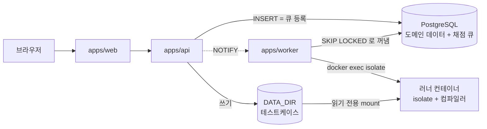

# OJIK 오직

온라인 저지입니다. 문제를 풀고 제출하면 샌드박스 안에서 채점합니다.
교재, 문제집, 대회, 코딩 테스트를 하나의 구조로 다룹니다.

이름은 **OJ**(Online Judge)에 만든 사람 핸들을 이어 붙인 것이고, 한국어로 **오직**으로 읽힙니다.

---

## 목차

- [구조](#구조)
- [설계 원칙](#설계-원칙)
- [운영](#운영)
- [개발](#개발)
- [변경 이력](#변경-이력)

---

## 구조

### 저장소 구성

```
packages/core      모든 패키지가 참조하는 단일 출처
packages/db        Drizzle 스키마, 마이그레이션, 채점 큐 연산
apps/api           Hono REST API
apps/worker        채점 오케스트레이터
apps/web           SvelteKit SPA
images/runner      언어별 채점 런타임 이미지
scripts            운영 스크립트
tests              판정 규칙과 큐 동작 테스트
```

전부 TypeScript입니다. **러너 컨테이너 안에는 우리 코드가 한 줄도 없습니다.** 컴파일러와
`isolate`뿐이고, 채점 로직은 워커 프로세스에 있습니다.

### 실행 구조



**메시지 큐가 없습니다.** 제출 테이블이 곧 큐입니다.

### 컬렉션

교재, 문제집, 대회, 코딩 테스트를 각각의 타입으로 두지 않습니다. 넷의 차이는 **정책 축의 값**뿐이라
`collections` 한 테이블로 다룹니다.

| | 시간 창 | 결과 공개 | 순위 | 참가 | 본문 |
|---|---|---|---|---|---|
| **교재** | 없음 | 즉시 | 없음 | 공개 | 설명 + 문제 |
| **문제집** | 기한(선택) | 즉시 | 진도 | 멤버 | 문제만 |
| **대회** | 고정 | 동결 | ICPC/IOI | 등록 | 문제만 |
| **코딩 테스트** | 개인별 | 종료 후 | 없음 | 초대 | 문제만 |

화면에서는 프리셋 버튼이 축 값을 채워 주므로 사용자는 축의 존재를 몰라도 됩니다.
정의는 [`packages/core/src/collections.ts`](packages/core/src/collections.ts)에 있습니다.

### 문서

| 문서 | 내용 |
|---|---|
| [`docs/architecture.md`](docs/architecture.md) | 전체 구조, 제출부터 판정까지의 흐름, 컴포넌트 간 계약 |
| [`docs/judge-pipeline.md`](docs/judge-pipeline.md) | 큐 설계, 상주 러너 풀, 보안 경계, 판정 규칙 |
| [`docs/schema.md`](docs/schema.md) | 테이블 구조와 인덱스 설계 근거 |
| [`docs/development.md`](docs/development.md) | 로컬 실행, 흔한 문제 |
| [`docs/koj-differences.md`](docs/koj-differences.md) | 참고한 KOJ에서 무엇을 왜 바꿨는지 |

---

## 설계 원칙

- **단일 출처.** 언어 목록은 [`languages.ts`](packages/core/src/languages.ts) 한 곳에만 있습니다.
  API 검증, 워커 실행, 프론트 선택지, PG enum이 전부 여기서 나옵니다.
- **조용한 실패 금지.** 설정 파싱에 실패하면 프로세스가 즉시 종료합니다. 지원하지 않는 언어는
  제출 단계에서 거부합니다. 빈 설정으로 계속 진행하지 않습니다.
- **복사하지 않기.** 테스트케이스는 러너 컨테이너에 읽기 전용으로 붙습니다. 제출마다 복사하지
  않습니다.
- **판정과 상태의 분리.** `status`는 채점이 어디까지 갔는지, `verdict`는 결과입니다. 시간 초과가
  오답으로 뭉개지지 않습니다.
- **재현 가능성이 저장보다 싸다.** 케이스별 출력을 다 저장하는 대신 소스와 테스트케이스를 남겨
  언제든 다시 채점합니다.

---

## 운영

### 필요한 것

| 항목 | 비고 |
|---|---|
| Node 22 이상 | `process.loadEnvFile`을 씁니다 |
| Docker | PostgreSQL과 러너 컨테이너 |
| 리눅스 커널 | `isolate`가 cgroup v2를 직접 씁니다. Windows와 macOS는 Docker의 리눅스 VM으로 충족됩니다 |

컨테이너 런타임은 Docker Desktop, OrbStack, colima, 리눅스 네이티브 Docker 어느 쪽이든 됩니다.
워커가 플랫폼에 맞는 접속 지점을 자동으로 고릅니다.

### 첫 설치

```bash
cp .env.example .env
node -e "console.log(require('crypto').randomBytes(32).toString('hex'))"
# 출력값을 .env 의 JWT_SECRET 에 넣습니다

npm install
npm run infra:up          # PostgreSQL
npm run db:migrate
npm run db:seed           # 개발용 계정과 예시 데이터

npm run runners:build     # 러너 이미지. 처음엔 몇 분 걸립니다
npm run smoke:judge       # 이게 통과해야 채점이 됩니다
```

**호스트 포트는 5432가 아니라 55432입니다.** 개발 PC에 PostgreSQL이 이미 깔려 있으면 5432를
그쪽이 잡고 있어서 연결이 그리로 갑니다. `POSTGRES_PORT`로 바꿀 수 있습니다.

### 실행

```bash
npm run dev:api           # :3000
npm run dev:web           # :5173
npm run dev:worker
```

### 명령

| 명령 | 용도 |
|---|---|
| `npm test` | 판정 규칙, 큐 동작, 순위표. PostgreSQL 필요. **워커를 멈추고 돌릴 것** |
| `npm run test:unit` | 판정 규칙만. DB 불필요 |
| `npm run typecheck` | 전 패키지 |
| `npm run smoke:judge` | isolate가 실물에서 도는지 확인. 등록된 전 언어를 한 번씩 돌림 |
| `npm run langs` | 지금 등록된 채점 언어와 필요한 러너 이미지 |
| `npm run e2e:submit` | 전 언어를 API 로 실제 제출해 판정까지 확인. API 와 워커 필요 |
| `npm run e2e:solutions` | 풀이 공유의 접근 규칙과 하루 한도 확인. API 와 워커 필요 |
| `npm run check:data` | DB의 해시와 테스트케이스 파일 대조 |
| `npm run recount` | 캐시 컬럼 정정. `-- --apply`로 실제 반영 |
| `npm run set-role` | 사용자 권한 변경 |

### 테스트 주의

**`npm test` 는 워커를 멈추고 돌려야 합니다.** 테스트가 만든 제출을 워커가 가로채면 결과가
흔들립니다. 워커가 떠 있으면 테스트가 시작하면서 거부하고 이유를 알려 줍니다.

테스트는 `submissions` 테이블을 비웁니다. 개발 DB 에서만 돌리세요.

### 운영 시 주의

**워커를 여럿 띄우려면 `WORKER_ID`와 `BOX_ID_BASE`를 워커마다 달리 줘야 합니다.**
같은 값이면 서로의 러너 컨테이너를 지우며 채점을 망칩니다. 같은 `WORKER_ID`로 두 번째 워커가
뜨면 거부되지만, `BOX_ID_BASE`가 겹치면 샌드박스 uid가 겹쳐 간헐적으로 실패합니다.

**`WORKER_CAPACITY * WORKER_TC_PARALLEL`이 CPU 코어 수를 넘으면 안 됩니다.** 넘으면 측정 시간이
부풀어 맞는 풀이가 시간 초과로 떨어집니다.

**성능 코어와 효율 코어가 섞인 CPU에서는 시간 측정이 흔들립니다.** 시간 제한을 넉넉히 잡거나,
그 환경에서 빡빡한 문제를 내지 않아야 합니다.

**러너 이미지나 isolate 버전을 올릴 때는 `npm run smoke:judge`를 먼저 통과시키세요.**
버전이 갈리면 플래그가 안 맞아 전 제출이 채점 오류가 됩니다.

**문제는 지우지 말고 비공개로 내리세요.** 삭제하면 제출 기록이 함께 사라집니다.

### 데이터

| 대상 | 위치 | 비고 |
|---|---|---|
| 도메인 데이터, 제출, 채점 결과 | PostgreSQL | |
| 테스트케이스 파일 | `DATA_DIR/problems/{id}/tc/` | DB는 sha256만 들고 있음 |
| 채점 작업 공간 | `BOX_ROOT` | 휘발성. tmpfs 권장 |

DB와 `DATA_DIR`은 **같은 시점으로 함께 백업**해야 합니다. 따로 되돌리면 행은 있고 파일이 없는
상태가 되는데, `npm run check:data`가 그걸 잡아냅니다.

---

## 개발

### 스키마 변경

```bash
# 1. packages/db/src/schema/ 를 고친다
npm run db:generate      # 2. 마이그레이션 SQL 생성
# 3. 생성된 packages/db/drizzle/*.sql 을 읽어 본다
npm run db:migrate       # 4. 적용
# 5. SQL 파일과 스냅샷을 함께 커밋
```

**생성된 SQL을 읽지 않고 넘기지 마세요.** 컬럼 이름을 바꾸면 drizzle-kit이 `drop` + `add`로
해석해 데이터가 날아갈 수 있습니다.

기동 시 자동 마이그레이션은 하지 않습니다. 배포와 스키마 변경을 분리해야 되돌릴 수 있습니다.

### 언어 추가

[`packages/core/src/languages.ts`](packages/core/src/languages.ts)에 항목 하나를 넣습니다.
API 검증, 워커 실행, 프론트 선택지, PG enum이 전부 여기서 나옵니다. 지금 뭐가 있는지는
`npm run langs`로 봅니다. 이 문서에 목록을 적어 두지 않는 건 반드시 어긋나기 때문입니다.

**같은 런타임에 플래그만 다른 언어는 비용이 거의 없습니다.** C++17과 C99가 그런 경우로,
`c-cpp` 이미지를 그대로 쓰고 컴파일 argv만 다릅니다. 이미지가 안 늘어나니 부담 없이 늘릴 수
있습니다. 반대로 새 런타임은 이미지 하나와 디스크를 더 씁니다.

새 문법 강조가 필요하면 `EditorMode`에 먼저 값을 더합니다. 안 더하면 에디터가 조용히 C++
문법으로 떨어집니다.

새 런타임이 필요하면 [`images/runner/`](images/runner/)에 `Dockerfile.<runner>`를 추가하고
`RunnerId`에 이름을 더합니다.

```bash
npm run db:generate      # language enum 에 값이 추가되므로 마이그레이션 필요
npm run db:migrate
npm run runners:build    # 새 런타임을 넣었을 때만
npm run smoke:judge      # 샌드박스에서 도는지
npm run e2e:submit       # 제출부터 판정까지 실제 경로로
```

**`db:generate` 를 잊으면 제출이 INSERT 에서 깨집니다.** `smoke:judge` 는 DB 를 안 거쳐서 이걸
못 잡습니다. `npm test` 의 enum 테스트와 `e2e:submit` 이 잡습니다.

### CI

[`.github/workflows/ci.yml`](.github/workflows/ci.yml)가 푸시와 PR 에서 돕니다.
타입 검사, 마이그레이션, 시드, 테스트, 빌드까지 실제 Postgres 를 붙여서 봅니다.

마지막 단계로 `db:generate` 를 한 번 더 돌려 `packages/db/drizzle` 에 변경이 남는지 봅니다.
남으면 스키마를 고치고 생성물을 안 만든 것이라 실패합니다.

**채점 스모크는 CI 에서 안 돕니다.** `isolate` 가 cgroup v2 위임과 privileged 컨테이너를
요구해서 GitHub 러너에서 안정적으로 못 돌립니다. 샌드박스는 실기에서 `npm run smoke:judge`,
제출 경로는 `npm run e2e:submit` 으로 봅니다.

### 커밋

```
브랜치     work-YYYYMMDD
제목       한국어 명사구. feat: 같은 접두어를 쓰지 않는다
본문       변경이 클 때만. 무엇을 왜 바꿨는지
```

`main`에 직접 커밋하지 않습니다. 푸시 후 PR로 머지합니다.

---

## 변경 이력

버전은 의미 있는 기능 묶음이 끝날 때 올립니다. 날짜는 작업일입니다.

### 버전 규칙

`MAJOR.MINOR.PATCH`를 따르되, 1.0.0 전까지는 아래 기준으로 씁니다.

| 자리 | 올리는 때 |
|---|---|
| PATCH | 버그 수정, 문구 수정 |
| MINOR | 기능 추가, 스키마 변경 |
| MAJOR | 1.0.0 전까지 안 올림 |

**태그와 이 문서의 절이 1대1로 대응해야 합니다.** 태그만 있고 이력이 없거나 반대면,
나중에 "이 버전이 뭘 바꿨더라"를 코드에서 찾아야 합니다.

```bash
# 1. 아래 변경 이력에 새 절을 추가한다
# 2. 커밋한다
git tag -a v0.2.0 -m "v0.2.0 ..."
git push origin main --follow-tags
```

`--follow-tags`를 쓰면 커밋과 주석 태그가 같이 올라갑니다. 태그만 따로 올리는 걸 잊으면
GitHub의 릴리스 목록이 비어 보입니다.

태그는 **주석 태그**(`-a`)로 만듭니다. 가벼운 태그는 작성자와 날짜가 안 남습니다.

### v0.2.0 (2026-09-16) 화면 보강, 언어 확장, 풀이 공유

v0.1.0 은 채점은 됐지만 브라우저로 할 수 있는 일이 적었습니다. 문제 등록이 API 직접 호출이라
사실상 쓸 수 없었고, 문제 본문이 평문이라 수식이 든 문제를 낼 수 없었습니다. 그 둘을 막고
채점 언어를 4종에서 8종으로 늘렸습니다.

**풀이 공유**

- 그 문제를 맞힌 사람만 풀이를 읽고 쓸 수 있음. staff 이상은 검수를 위해 늘 읽을 수 있음
- 하루 쓰기 한도. 글과 댓글을 합쳐 `3 + 맞힌수/10`, 최대 20. 하루 경계는 한국 시간
- 링크는 5문제를 맞힌 뒤부터. 가입 직후 계정의 광고를 막는 용도
- 지운 글은 표시만 남김. 달린 댓글이 같이 사라지지 않게
- 판정이 아직 안 공개된 제출은 맞힘으로 안 셈. 코딩테스트에서 풀이 화면이 열리는 것만으로
  정답 여부가 드러나면, 감추기로 한 판정이 옆문으로 새는 것이라 같은 규칙을 따름

**화면**

- 관리 화면. 문제 등록과 수정, 테스트케이스 편집, 컬렉션 구성, 권한 변경
- 마크다운 입력칸. 쓰기와 미리보기 탭
- 마크다운 렌더링. 표, 코드 블록, LaTeX 수식, mermaid 도식
- 순위표 화면. 진도, ICPC, IOI 세 규칙과 동결 반영
- 제출 실패 시 몇 번째 케이스에서 틀렸는지 표시. 프로그램 출력은 공개 예제일 때만

**채점**

- C++17, C99 추가. `c-cpp` 이미지를 그대로 쓰고 컴파일 플래그만 다름
- PyPy3 추가. 같은 파이썬 풀이가 CPython 으로는 시간 초과인 경우를 통과시킴
- Node.js 22 추가
- 러너 지연 기동. 해당 언어의 첫 제출까지 컨테이너를 안 띄움. 기동 시 5개에서 1개로
- 워커 등록에 pid 를 남겨, 같은 호스트에서 죽은 워커의 자리를 즉시 넘겨받음

**검증**

- 자동 테스트 61건 (판정 11, 큐 10, 순위표 10, 마크다운 13, enum 대조 7, 풀이 규칙 10)
- `smoke:judge` 41건. 등록된 전 언어를 정상, 시간 초과, 컴파일 오류로 한 번씩 실행
- `e2e:submit` 추가. 전 언어를 API 로 실제 제출해 판정까지 확인하고, 숨은 케이스 유출도 함께 봄
- GitHub Actions CI. 타입 검사, 마이그레이션, 시드, 테스트, 빌드, 생성물 최신 여부
- `e2e:solutions` 추가. 안 맞힌 사람 차단, 링크 제한, 하루 한도가 실제로 막는지

**고친 것**

- 순위표가 500 을 내던 문제. `Date` 를 raw SQL 인자로 넘기면 postgres-js 가 직렬화하지 못함
- 큐에서 꺼낸 행의 키가 snake_case 로 와서 워커가 문제 id 를 못 읽던 문제. 채점이 전혀 안 됐음
- 사라진 러너 컨테이너를 워커가 자동 복구하려다 409 가 연쇄로 나던 문제. 자동 복구를 뺌
- `editorMode` 유니온을 웹이 따로 들고 있어, 언어를 늘려도 타입이 안 걸리던 문제
- 늘린 언어 4종의 PG enum 마이그레이션이 빠져 있던 문제. 그 언어로 제출하면 INSERT 에서 깨졌음
- 숨은 테스트케이스가 제출자에게 새던 문제. 채점기가 케이스마다 stdout/stderr 을 저장했고
  제출자가 그걸 볼 수 있어서, `print(input())` 으로 한 제출에 케이스 하나씩 뽑을 수 있었음.
  공개 예제에서만 출력을 남기게 고침. 숨은 케이스의 런타임 에러 메시지는 이제 안 보임

**마이그레이션**

```bash
npm run db:migrate       # judge_workers.pid, language enum 값 4개
npm run runners:build    # pypy, node 이미지 추가
```

**알려진 한계**

- 이메일 인증 없음. 가입 시 주소 소유를 확인하지 않음
- 부분점수와 스페셜 저지는 스키마만 있고 화면과 채점 경로가 없음
- SVG 그림판 미구현. 도식은 mermaid 로만
- 학교 그룹, 학교 랭킹 미구현

### v0.1.0 (2026-09-16) 최초 구현

동작하는 최소 저지입니다. 제출부터 판정까지 전 과정이 돌고, 4개 언어를 지원합니다.

**채점**

- PostgreSQL 기반 채점 큐 (`FOR UPDATE SKIP LOCKED` + `LISTEN/NOTIFY`). 메시지 큐 없음
- 언어별 상주 러너 컨테이너 풀. 제출마다 컨테이너를 띄우지 않음
- isolate 2.7 샌드박스. cgroup v2 위임을 컨테이너 진입점에서 직접 처리
- 테스트케이스를 읽기 전용으로 붙이고 실행 직전 해당 케이스 하나만 복사
- C17, C++20, Python 3.13, Java 21
- 판정 8종: 정답, 오답, 시간 초과, 메모리 초과, 출력 초과, 런타임 에러, 컴파일 에러, 채점 오류
- 죽은 워커 회수, 자동 재시도 3회, 재채점 API
- 같은 `WORKER_ID` 중복 기동 차단
- 박스 id를 워커 전역으로 배분해 샌드박스 uid 충돌 방지

**도메인**

- 컬렉션 통합. 교재, 문제집, 대회, 코딩 테스트를 정책 축 조합으로 표현
- 개인별 타이머(코딩 테스트), 결과 숨김, 스코어보드 동결
- 순위 규칙: 진도, ICPC, IOI
- 이메일 로그인. 계정당 이메일 2개까지
- 연구 목적 이용 동의 (선택, 기본 꺼짐)
- 채점 환경과 테스트케이스 버전 기록

**화면**

- SvelteKit SPA. 라우트별 첫 로드 32~40 KB gzip
- CodeMirror 6 에디터. 제출 영역이 그려질 때만 지연 로드
- 채점 현황 폴링, 다크 모드

**검증**

- 자동 테스트 21건 (판정 규칙 11, 큐 동작 10)
- `smoke:judge` 16건. 워커가 실제로 만드는 isolate 인자를 그대로 검증

**알려진 한계**

- 이메일 인증 없음. 가입 시 주소 소유를 확인하지 않음
- 관리자 화면 없음. 문제 등록과 테스트케이스 업로드가 API 직접 호출
- 문제 본문이 평문으로 렌더링됨. 마크다운, 수식, 도식 미지원
- 부분점수와 스페셜 저지는 스키마만 있고 화면과 채점 경로가 없음
- 학교 그룹, 커뮤니티, GitHub Actions CI 미구현
