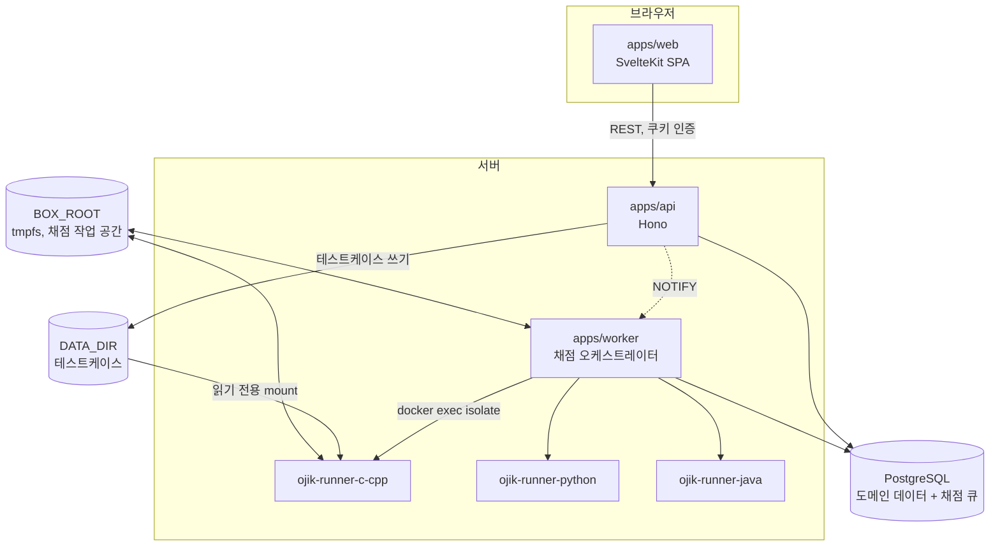
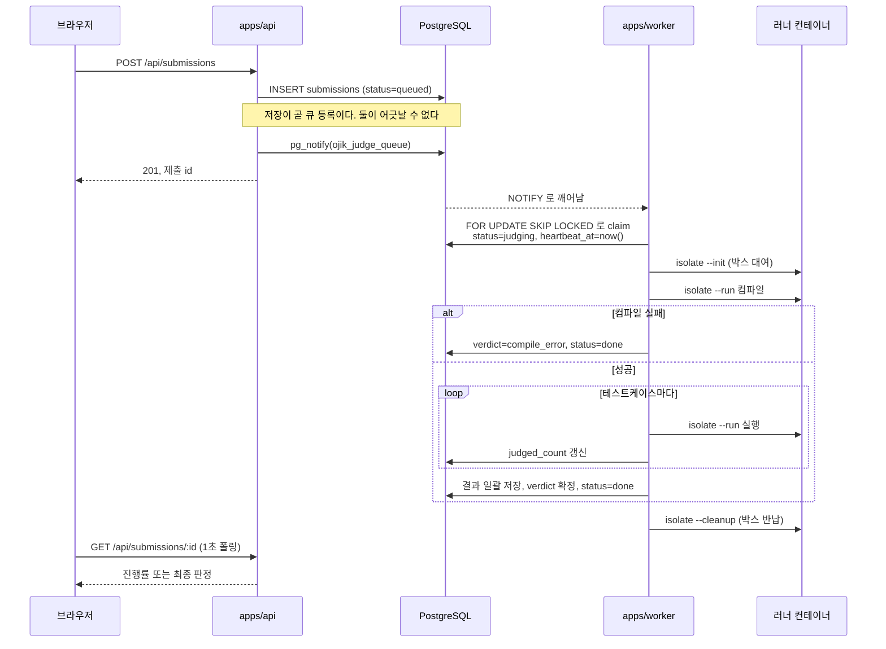

# 아키텍처

[README](../README.md) | [채점 파이프라인](judge-pipeline.md) | [스키마](schema.md) | [KOJ와의 차이](koj-differences.md)

## 전체 구조

프로세스는 셋입니다. API, 워커, 정적 파일로 배포되는 웹입니다. 인프라는 PostgreSQL 하나입니다.



분리 원칙은 셋입니다.

- **API는 채점하지 않습니다.** 제출을 저장하면 그게 곧 큐 등록입니다.
- **워커는 컴파일과 실행을 직접 하지 않습니다.** 러너 컨테이너에 `isolate` 실행을 지시하고
  결과 파일을 읽습니다.
- **러너 컨테이너에는 우리 코드가 없습니다.** 컴파일러와 `isolate`뿐입니다. DB도 큐도 모릅니다.

## 제출부터 판정까지



## 컴포넌트 간 계약

레포가 하나라도 프로세스는 나뉘어 있습니다. 아래 계약이 깨지면 코드가 정상이어도 채점이
실패합니다.

### 타입 계약

`@ojik/core`와 `@ojik/db`가 **컴파일 시점에** 강제합니다. 별도 문서가 필요 없고, 어기면 타입체크가
깨집니다.

KOJ는 이 계약이 Go module 버전이었습니다. 백엔드의 entity를 고치고 워커와 채점 이미지의 module
버전을 안 올리면 **아무 에러 없이** 옛 구조체로 동작했습니다.

### DB 계약

API와 워커가 같은 `DATABASE_URL`을 봐야 합니다. 스키마의 주인은
[`packages/db/src/schema/`](../packages/db/src/schema/)이고, 변경은 `npm run db:generate`로 SQL
마이그레이션 파일을 만들어 커밋합니다. 앱 기동 시 자동 마이그레이션은 하지 않습니다.

KOJ는 백엔드 기동 시 `AutoMigrate`가 스키마를 바꿨습니다. 이력이 남지 않아 되돌릴 수 없고,
PostgreSQL enum은 `AutoMigrate`가 만들지 못해 `sql/create_enum.psql`을 손으로 따로 적용해야
했습니다. 여기서는 enum도 마이그레이션 파일에 들어갑니다.

### 파일 계약

API가 쓰고 워커가 읽습니다. 경로는 하나입니다.

```
{DATA_DIR}/problems/{problemId}/tc/{idx}.in
{DATA_DIR}/problems/{problemId}/tc/{idx}.out
```

DB의 `testcases` 행은 경로가 아니라 **sha256과 크기**를 들고 있습니다. 백업에서 DB만 되돌려
파일과 어긋나면 [`npm run check:data`](../scripts/check-data.ts)가 잡아냅니다.

`DATA_DIR`이 상대 경로여도 [`loadEnv`](../packages/core/src/loadenv.ts)가 `.env` 위치 기준
절대경로로 고정합니다. API는 `apps/api`에서, 워커는 `apps/worker`에서 뜨는데 상대 경로를 그대로
두면 서로 다른 곳을 가리킵니다.

### 컨테이너 계약

워커가 러너 컨테이너를 만들고 지웁니다. 사람이 손으로 띄우는 게 아닙니다.

| 항목 | 값 |
|---|---|
| 이미지 | `{RUNNER_IMAGE_PREFIX}-{runner}:latest` |
| 컨테이너 이름 | `{RUNNER_CONTAINER_PREFIX}-{runner}-{replica}` |
| 마운트 | `{BOX_ROOT}/{runner}-{replica}` -> `/var/local/lib/isolate` |
| 마운트 | `{DATA_DIR}/problems` -> `/problems` (읽기 전용) |
| 네트워크 | `none` |
| 권한 | `privileged` ([근거](judge-pipeline.md#보안-경계)) |

워커가 뜰 때 같은 이름의 컨테이너가 있으면 지우고 새로 만듭니다. 이전 실행의 박스 상태가
어중간하게 남는 걸 막기 위해서입니다.

## 인증

JWT를 **httpOnly 쿠키**에 담습니다. 스크립트가 못 읽으므로 XSS로 토큰이 새지 않습니다.
`Authorization: Bearer`도 받습니다. CLI나 스크립트에서 쓰라고 남겨 둔 경로입니다.

토큰의 `role`을 그대로 믿지 않고 요청마다 DB에서 사용자를 다시 읽습니다. 권한을 내려도 기존
토큰이 만료까지 살아 있는 문제를 막기 위해서입니다. 비용은 요청당 인덱스 조회 하나입니다.

접근 판정은 [`apps/api/src/access.ts`](../apps/api/src/access.ts) 한 곳에 모았습니다. 화면에서
버튼을 숨기는 건 안내일 뿐이고, 실제 차단은 전부 여기를 거칩니다.

## 오류 처리

| 계층 | 정책 |
|---|---|
| 설정 | 파싱 실패 시 프로세스 즉시 종료. 빈 설정으로 진행하지 않음 |
| API | `app.onError`가 모든 예외를 500으로 변환. 내부 메시지는 감춤 |
| API 응답 | 비공개 리소스는 403이 아니라 404. 존재 여부를 흘리지 않음 |
| 워커 | 채점 실패는 큐로 되돌림. 3회 넘으면 `internal_error` 확정 |
| 워커 종료 | SIGTERM에 새 제출을 안 잡고 진행 중인 것만 마침 |
| 프론트 | 상태 코드 없는 오류도 한국어 안내로 변환 |

KOJ가 여기서 겪은 것들은 [KOJ와의 차이](koj-differences.md)에 항목별로 있습니다.
