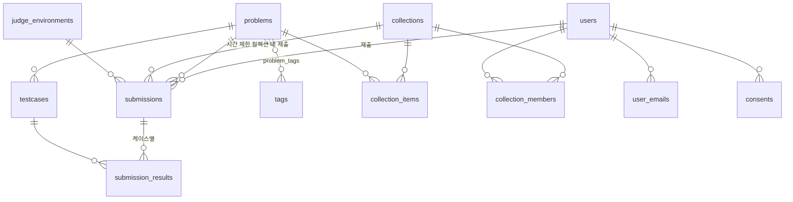

# 스키마

[README](../README.md) | [아키텍처](architecture.md) | [채점 파이프라인](judge-pipeline.md)

정의는 [`packages/db/src/schema/`](../packages/db/src/schema/)에 있습니다. 여기는 왜 그렇게
생겼는지입니다.

## 테이블 관계



## enum

PostgreSQL enum 타입을 씁니다. 값은 [`@ojik/core`](../packages/core/src/)의 상수 배열에서 그대로
나오므로 TypeScript와 DB가 갈릴 자리가 없습니다.

```ts
export const verdictEnum = pgEnum("verdict", VERDICTS);
```

KOJ는 Go enum과 `sql/create_enum.psql`을 손으로 맞춰야 했고, `AutoMigrate`가 enum을 만들지
않아서 SQL 적용을 잊으면 조용히 깨졌습니다.

**enum에 값을 추가하면 마이그레이션이 필요합니다.** 언어를 추가할 때 `npm run db:generate`를
잊지 마세요.

## submissions

가장 중요한 테이블입니다. 도메인 데이터이자 **채점 큐**입니다.

### 큐 제어 컬럼

| 컬럼 | 용도 |
|---|---|
| `status` | `queued` / `judging` / `done` / `canceled` |
| `priority` | 높을수록 먼저. 대회 제출이 100, 연습이 0 |
| `attempts` | 자동 재시도 횟수. 3회 넘으면 `internal_error` 확정 |
| `claimed_by` | 지금 잡고 있는 워커 id |
| `heartbeat_at` | 워커 생존 신호. 끊기면 다른 워커가 회수 |
| `queued_at` | 재채점 시 갱신. 대기 시간 계산 기준 |

### 인덱스

부분 인덱스가 핵심입니다.

```sql
CREATE INDEX submissions_queue_idx ON submissions (priority DESC, id ASC)
    WHERE status = 'queued';
```

제출이 수백만 건 쌓여도 이 인덱스에는 대기 중인 행만 들어갑니다. 큐 조회 비용이 누적 제출
총량과 무관해집니다.

```sql
CREATE INDEX submissions_lease_idx ON submissions (heartbeat_at) WHERE status = 'judging';
CREATE INDEX submissions_ac_idx ON submissions (problem_id, user_id) WHERE verdict = 'accepted';
```

셋 다 `WHERE` 절이 붙어 있습니다. 각각 회수 대상 찾기, 맞힌 사람 집계용입니다.

### status 와 verdict

둘을 나눈 이유는 [채점 파이프라인](judge-pipeline.md#상태와-판정의-분리)에 있습니다.
`verdict`는 `status = 'done'`일 때만 값이 있습니다.

### 소스 코드

`source_code`를 테이블에 직접 넣습니다. 별도 저장소를 두지 않습니다.

제출 소스는 보통 수 KB이고 상한이 256 KB입니다. 파일로 빼면 DB와 파일의 정합성을 또 관리해야
하는데, 그 비용이 테이블이 커지는 비용보다 큽니다. 테스트케이스를 파일로 뺀 것과 반대 판단인
이유는, 테스트케이스는 러너 컨테이너가 **직접 읽어야** 하고 크기도 훨씬 크기 때문입니다.

## testcases

파일 본체는 `{DATA_DIR}/problems/{problemId}/tc/{idx}.in|.out`에 있습니다. DB는 **sha256과
크기만** 들고 있습니다.

경로 문자열이 아니라 해시인 이유는 [`check-data.ts`](../scripts/check-data.ts) 때문입니다.
경로만 있으면 백업에서 DB만 되돌렸을 때 행은 있고 파일은 없는 상태를 알아챌 수 없습니다.
해시가 있으면 파일 없음과 내용 다름을 구분해 짚을 수 있습니다.

`(problem_id, idx)`가 유일합니다. `idx`가 곧 파일 이름이므로 중복되면 어느 파일이 채점에 쓰일지
알 수 없게 됩니다.

테스트케이스는 **전체 교체만** 됩니다. 부분 수정 API를 두지 않았습니다. 순번과 파일이 어긋난
중간 상태가 생기면 어떤 제출이 무엇으로 채점됐는지 추적이 불가능해집니다.

## 캐시 컬럼

| 테이블 | 컬럼 | 진짜 값 |
|---|---|---|
| `users` | `solved_count` | `submissions`에서 verdict=accepted인 distinct problem_id |
| `users` | `submission_count` | `submissions` 행 수 |
| `problems` | `accepted_count` | verdict=accepted인 distinct user_id |
| `problems` | `submission_count` | `submissions` 행 수 |

목록과 랭킹에서 매번 집계하면 느려서 둔 값입니다. **증가만 시키므로 재채점으로 판정이 뒤집히면
어긋납니다.** 정정은 [`npm run recount`](../scripts/recount.ts)입니다.

이건 설계상의 절충이고 숨길 일이 아닙니다. 정확한 값이 필요한 자리(성적 산출, 스코어보드)에서는
캐시를 안 쓰고 `submissions`를 직접 집계합니다.

## collections

교재, 문제집, 대회, 코딩 테스트를 **한 테이블로** 덮는다.

넷을 각각의 테이블로 두면 문제 목록, 진행률, 권한 검사, 제출 필터를 네 번 구현하게 된다.
실제로 넷의 차이는 종류가 아니라 정책 축의 값이다.

| 축 | 컬럼 | 값 |
|---|---|---|
| 시간 창 | `timing` | `none` / `fixed` / `per_user` |
| 결과 공개 | `reveal` | `immediate` / `frozen` / `after_end` |
| 순위 | `scoring` | `none` / `progress` / `icpc` / `ioi` |
| 참가 | `join_policy` | `open` / `members` / `register` / `invite` |
| 항목 종류 | `collection_items.kind` | `problem` / `text` |

`preset` 컬럼은 **동작을 정하지 않는다.** 어떤 의도로 만들었는지만 기록해 표시와 기본값에 쓴다.
축 조합이 말이 되는지는 스키마로 못 막으므로 API 의 `validateAxes` 가 검사한다.

### collection_items

`kind='text'` 를 섞을 수 있다는 것이 **교재를 가능하게 하는 유일한 차이**다. 설명 문단과 문제가
한 목록에 순서대로 놓인다.

### collection_members

문제집 멤버, 대회 등록, 코딩 테스트 초대를 하나로 본다.

`timing='per_user'` 면 `started_at` 과 `ends_at` 이 사람마다 다르다. `fixed` 면 컬렉션의 값을 쓰고
이 컬럼은 비어 있다. 한 코드로 둘 다 처리한다.

## user_emails

계정당 이메일을 둘까지 둔다. 로그인은 등록된 아무 주소로나 된다.

별도 테이블인 이유는 나중에 학교 메일을 추가로 등록하거나 주소를 바꿀 때 기존 주소를 살려 둔 채
갈아탈 수 있어야 해서다. `users.email` 하나로는 둘 다 안 된다.

`verified_at` 은 지금 전부 null 이다. 인증 없이 가입을 받되 컬럼은 미리 만들어 뒀다. 나중에 인증을
붙일 때 마이그레이션이 필요 없고, 학교 배지는 이 값이 있는 주소만 본다.

개수 상한은 API 에서 검사한다. 제약으로 박으면 늘릴 때 마이그레이션이 필요하다.

## consents

연구 목적 이용 동의. **동의는 나중에 받을 수 없어서** 지금 만들어 둔다. 데이터가 쌓인 뒤에
물으려면 이미 떠난 사용자에게 연락해야 하고 그건 사실상 불가능하다.

`version` 은 문구가 바뀌었을 때 누가 어떤 문구에 동의했는지 가리는 값이다. 철회는 행을 지우지 않고
`revoked_at` 을 찍는다.

## judge_environments

채점이 이뤄진 환경. 워커 id, 호스트명, 아키텍처, 러너 이미지 다이제스트, isolate 버전.

시간과 메모리 값은 어떤 기계에서 어떤 컴파일러로 쟀는지를 모르면 해석할 수 없다. 특히 성능 코어와
효율 코어가 섞인 CPU 에서는 같은 코드가 2배까지 차이 난다.

제출마다 jsonb 를 박으면 무겁다. 서로 다른 환경은 몇 년 써도 수십 개뿐이라 따로 두고 참조만 한다.
제출당 비용은 4바이트다.

## judge_workers

채점에 꼭 필요한 테이블은 아닙니다. 없어도 큐는 돕니다.

두는 이유는 "채점이 안 도는데 워커가 살아 있나"를 서버에 SSH로 붙지 않고 확인하기 위해서입니다.
KOJ에서 반복된 1차 확인 작업입니다. `GET /api/health`가 이 테이블과 큐 상태를 같이 내려줍니다.

## 삭제 정책

| 대상 | 동작 |
|---|---|
| 문제 삭제 | 테스트케이스, 제출, 결과가 cascade로 같이 삭제. 파일도 삭제 |
| 사용자 삭제 | 제출이 cascade로 삭제 |
| 문제 작성자 삭제 | `problems.created_by`가 null이 됨. 문제는 남음 |
| 테스트케이스 삭제 | `submission_results.testcase_id`가 null. 결과는 `idx`로 남음 |

**문제를 지우면 제출 기록이 사라집니다.** 기록을 남겨야 하면 지우지 말고 `is_public`을 끄세요.
`DELETE /api/problems/:id`를 admin 전용으로 둔 이유입니다.
